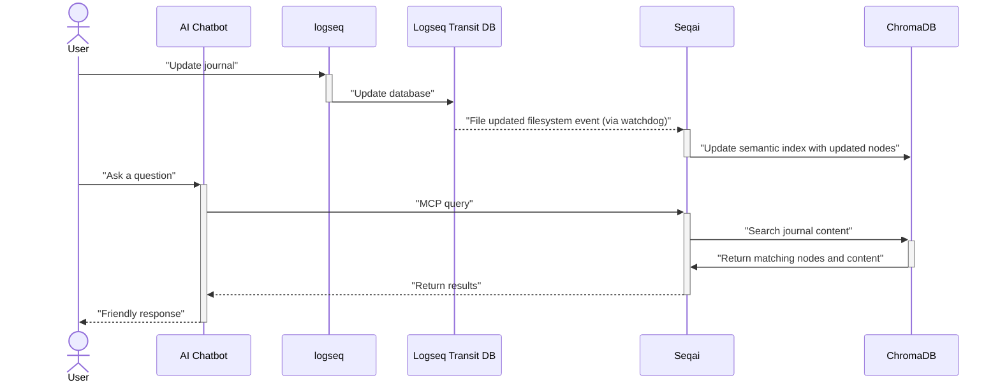

# Seqai

Seqai is a tool that makes your logseq journal searchable with AI tools.

## Setup

```sh
pip install -e .
uv sync
```

## Running

To run SeqAI, use the following commands with the path to your Logseq journal directory:

- **Start the MCP server**: `python main.py -p /path/to/your/logseq/journal server`
- **Run CLI**: `python main.py -p /path/to/your/logseq/journal cli`
- **Reindex notes**: `python main.py -p /path/to/your/logseq/journal reindex`
- **Semantic search**: `python main.py -p /path/to/your/logseq/journal semantic-search`

The `-p` or `--path` parameter specifies the path to your Logseq journal directory containing the transit DB version of your journal. The default path is `/Users/erica/notes` if not specified.

## How it works

This MCP server indexes your journal into a local ChromaDB vector database and provides MCP tools for searching and conversing with your journal. You can connect your AI/chatbot to this MCP server.

### Overall flow

This server watches your logseq graph transit database file for updates and updates the ChromaDB vector database. 

